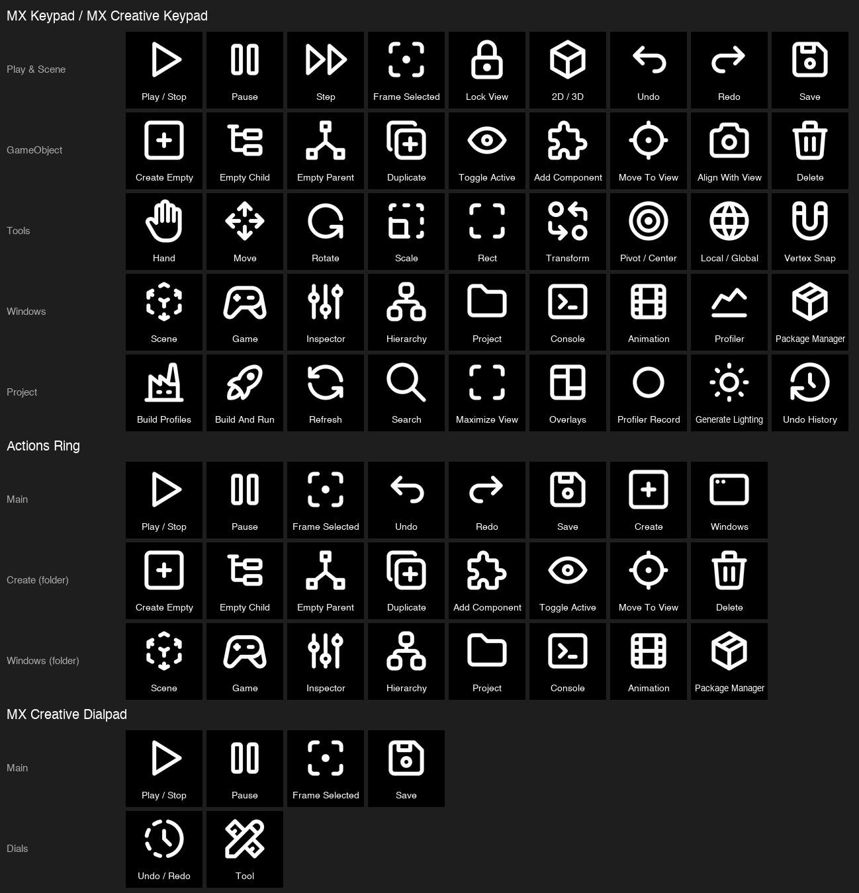

# Editor Controls for Unity

A Logi Options+ plugin that puts the Unity Editor on your Logitech keys, dials and Actions Ring:
**91 ready-made actions with icons** and **default profiles for every device**, so there is nothing to set up by hand.



## Features

- **91 actions** in 11 groups — Play Mode, Scene View, Grid & Snap, GameObject, Selection, Tools, Windows, Edit,
  Project, Animation, and 8 dial actions (Undo / Redo, tool switching, animation frames and keys, selection history,
  grid size, list navigation, frame-by-frame stepping).
- **Follows your Unity shortcuts.** If you rebound a command in Unity (*Edit → Shortcuts*), the plugin sends your
  binding, including bindings inherited from a parent profile. A command you unbound in Unity does nothing.
- **Default profiles** for MX Keypad / MX Creative Keypad (5 pages), MX Creative Dialpad (buttons + dial + roller)
  and the Actions Ring (with *Create* and *Windows* folders). They install with the plugin and switch on
  automatically when Unity is in front.
- **9 languages:** English, Russian, German, French, Spanish, Brazilian Portuguese, Japanese, Korean,
  Simplified Chinese.
- Works on **macOS and Windows**, with any keyboard layout.

## Supported devices

| Device | Default profile |
|---|---|
| MX Keypad, MX Creative Keypad | 5 pages of 9 keys: Play & Scene, GameObject, Tools, Windows, Project |
| MX Creative Dialpad | Play / Stop, Pause, Frame Selected, Save; dial = Undo / Redo, roller = tool |
| Actions Ring (Logi Options+ mice and keyboards) | 6 actions + *Create* and *Windows* folders |
| Loupedeck CT / Live / Live S | All actions are available; no default profile |

## Compatibility

- **Unity 6** (6000.x): every action.
- **Unity 2022.3**: everything except the actions marked *Unity 6+* in their description — Shaded / Wireframe /
  Shaded Wireframe (they exist in 2022 but have no default shortcut; bind them in Unity and the keys work), Unlit,
  Grid & Snap, and Previous / Next Selection.
- **Logi Options+** with Logi Plugin Service 6.4 or newer.
- Actions are Unity keyboard shortcuts, so the Unity Editor must be the active window.

## Install

- **Logitech Marketplace** — search for *Editor Controls for Unity* in Logi Options+ *(coming soon)*.
- **Manually** — download `UnityEditorControls_<version>.lplug4` from [Releases](../../releases) and double-click it.

Options+ lists apps installed in the top levels of `/Applications`, and Unity Hub installs editors deeper than that, so
Unity may be missing from Options+' *Add application* list. You don't need it: the plugin adds **Unity Editor** with its
profiles on install.

## Building from source

Requirements: .NET 10 SDK, Logi Options+ (Logi Plugin Service ≥ 6.4), Python 3 with Pillow, and
`LogiPluginTool` (`dotnet tool install --global LogiPluginTool`). The build scripts are for macOS.

```bash
./build.sh   # icons + profiles + localization + Debug build; installs a dev link and reloads the plugin
./pack.sh    # Release build → dist/UnityEditorControls_<version>.lplug4, checked with `logiplugintool verify`
```

`build.sh` uses the .NET SDK in `~/.dotnet` (`dotnet-install.sh --channel 10.0 --install-dir ~/.dotnet`).
Changed icons or profiles need a Logi Plugin Service restart. A profile already installed for a device is never
overwritten by a newer default. `python3 profiles/build_profile.py --docs` re-renders `docs/default-profiles.png`.

### Layout

| Path | What |
|---|---|
| `src/Unity/UnityShortcuts.cs` | The catalog: Unity Shortcut Manager id + Unity 6 default binding (+ Windows / Unity 2022 differences) |
| `src/Unity/UnityShortcutProfile.cs` | Reads the active Unity shortcut profile (EditorPrefs + `.shortcut` files, parent chain) |
| `src/Unity/UnityBinding.cs` | Unity `KeyCode` / `ShortcutModifiers` → Logi virtual keys |
| `src/Actions/` | One-line action classes per group; `Adjustments.cs` for dials |
| `icons/` | `map.tsv` (action → Tabler icon) and `build_icons.py` → `actionsymbols/` (picker) + `actionicons/` (keys) |
| `profiles/` | Default profile layouts (`Loupedeck70` Keypad, `71` Dialpad, `72` Actions Ring) and their builder |
| `localization/` | `translations.json` + `build_xliff.py` over the XLIFF template generated by Logi Plugin Service |

### Adding an action

1. Add the shortcut to `UnityShortcuts.cs` — id and default binding from Unity's Shortcut Manager.
2. Add a one-line class next to its group in `src/Actions/*Commands.cs`.
3. Add `<ClassName>\t<tabler-icon>` to `icons/map.tsv`; put the [Tabler](https://tabler.io/icons) outline icon
   into `icons/tabler/`.
4. `./build.sh`, then refresh the XLIFF template (`open "loupedeck://plugin/UnityEditorControls/xliff"`, copy
   `bin/Debug/localization.generated/UnityEditorControls.xliff` over `localization/UnityEditorControls.template.xliff`)
   and add the new strings to `translations.json`; `build_xliff.py` fails on any missing translation.

## License

[End User License Agreement](EULA.md). Third-party components: [Tabler Icons](https://github.com/tabler/tabler-icons),
MIT — see [THIRD_PARTY_NOTICES.md](THIRD_PARTY_NOTICES.md).

Unity is a trademark of Unity Technologies; Logitech, Logi, MX and Options+ are trademarks of Logitech.
This is an independent project, not affiliated with or endorsed by either.
